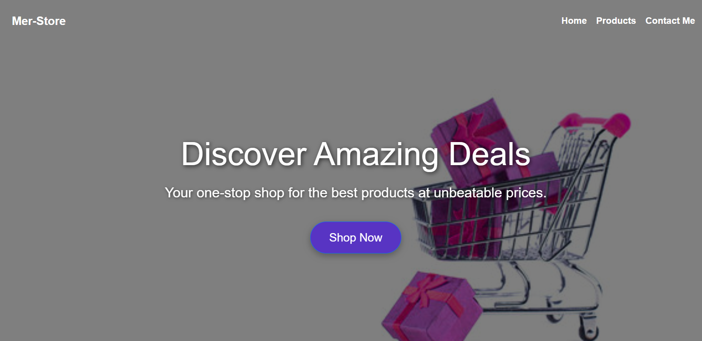
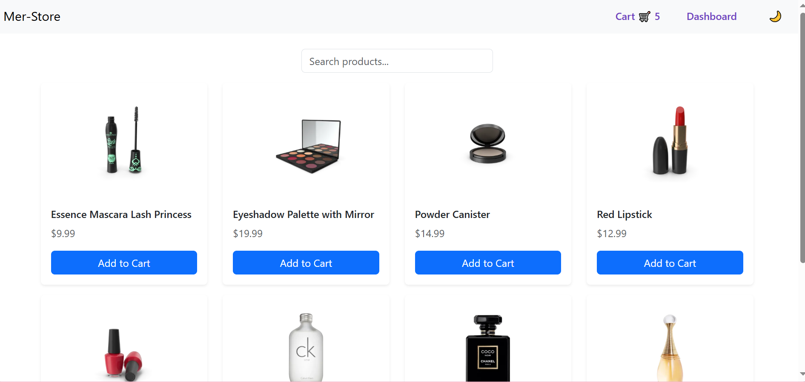
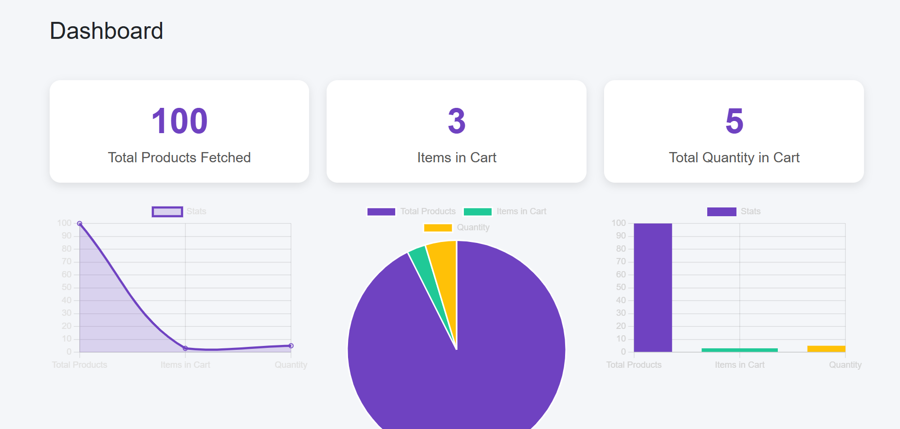

🛒 Simple eCommerce Dashboard

A beginner-friendly eCommerce dashboard project built with HTML, CSS, Bootstrap, and Vanilla JavaScript. This project demonstrates essential front-end concepts like DOM manipulation , localStorage, CRUD operations, and chart rendering using Chart.js.

---

✨ Features

- ✅ Add, edit, delete products (CRUD operations)
- 🛍️ Add items to cart and track total quantity
- 📦 Inventory management system
- 📈 Dashboard with sales charts and statistics
- 💾 Persistent cart and product storage using localStorage
- 🔄 DOM manipulation for dynamic UI updates
- 🌐 External API integration (optional placeholder API for products)

---

📸 Screenshots

🚀 Technologies Used

- HTML5
- CSS3
- Bootstrap 5
- JavaScript (ES6)
- Chart.js (for dashboard charts)
- **localStorage API**

---

📂 Project Structure
index.html
products.html
cart.html
dashboard.html

